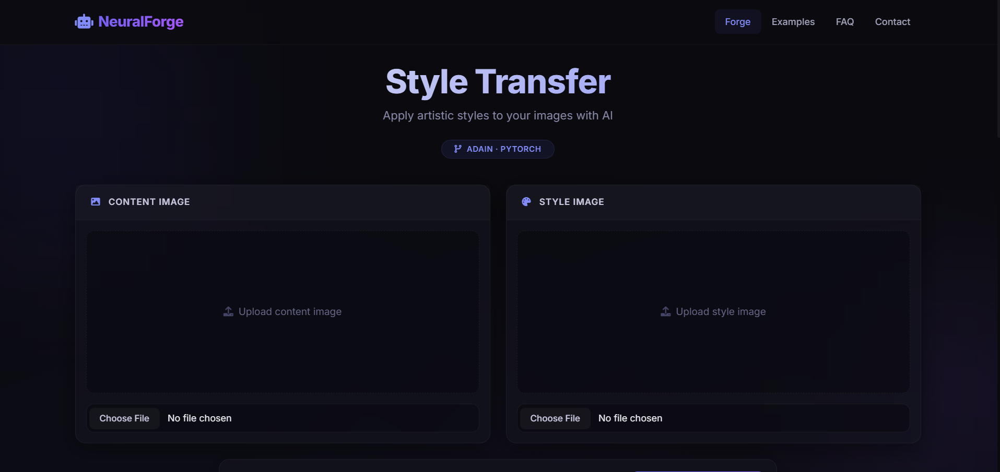
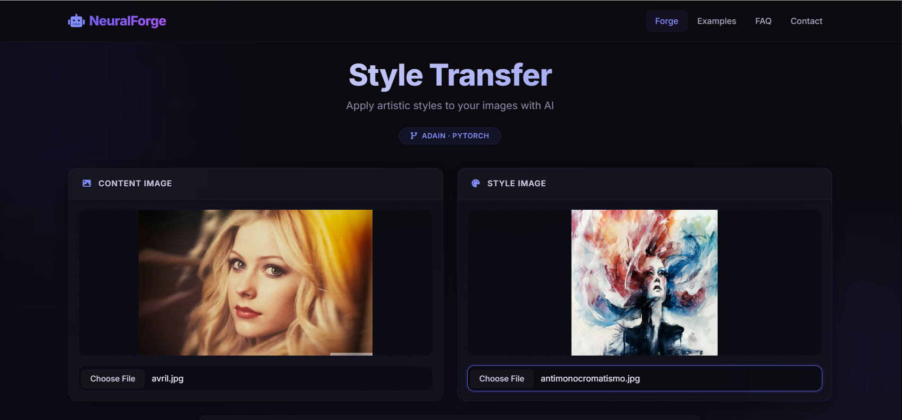
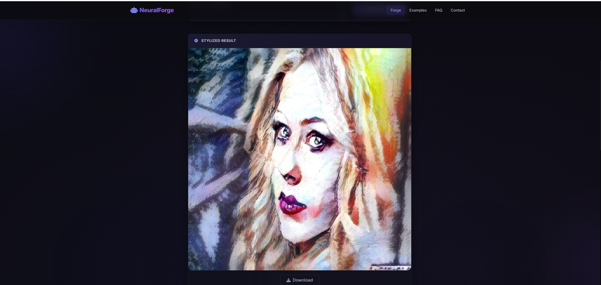

# 🎨 Neural Style Transfer Web Application

An interactive web application that applies the artistic style of one image to the content of another using a **custom-trained deep learning model from scratch**. Users can upload a content image and a style image to generate unique artistic compositions.

---

## 🚀 Features

- **Style Transfer**: Blend content and style images using a CNN trained from scratch
- **Simple Web Interface**: Clean, responsive UI built with vanilla HTML, CSS, and JavaScript
- **Real-time Processing**: Upload images and get stylized results instantly
- **Image Preview**: View content, style, and result images side-by-side
- **Download Output**: Save the generated stylized image to your device
- **Adjustable Parameters**: Control the style transfer intensity

---

## 🛠️ Tech Stack

### Frontend
- HTML5
- CSS3 (Vanilla CSS)
- JavaScript (Vanilla JS)

### Backend
- Python
- Flask
- Flask-CORS

### Deep Learning
- TensorFlow
- Keras
- NumPy
- Pillow (PIL)
- OpenCV

---

## 📂 Project Structure

```
neural_style_transfer/
├── backend/
│   ├── models/                 # Custom trained model weights
│   │   └── style_transfer_model.h5
│   ├── static/                 # Static files served by Flask
│   │   ├── uploads/            # Temporary storage for uploaded images
│   │   └── results/            # Storage for generated images
│   ├── utils/
│   │   ├── preprocess.py       # Image preprocessing functions
│   │   ├── model.py            # Custom CNN architecture definition
│   │   └── style_transfer.py   # Style transfer logic using custom model
│   ├── app.py                  # Main Flask application
│   └── requirements.txt        # Python dependencies
├── frontend/
│   ├── index.html              # Main HTML page
│   ├── style.css               # Custom CSS styles
│   ├── script.js              # Frontend JavaScript logic
│   └── assets/                 # Images, icons, etc.
├── training/
│   ├── train.py               # Model training script
│   ├── dataset/               # Training dataset
│   └── config.py              # Training configurations
├── screenshots/                # Project screenshots for README
├── .gitignore
└── README.md
```

---

## 📸 Screenshots


### Upload Interface


### Style Transfer Result


### Style Transfer Result


---

## ⚙️ How It Works

1. **Upload Images**: User uploads a content image and a style image through the web interface
2. **API Request**: Frontend sends images to Flask backend via AJAX/Fetch API
3. **Image Processing**: Backend preprocesses images (resize, normalize)
4. **Style Transfer**: Custom CNN model processes the images to generate stylized output
5. **Result Display**: Generated image is sent back and displayed in the browser
6. **Download Option**: User can download the final stylized image

---

## 🧠 Model Architecture

Our custom CNN model was trained from scratch specifically for neural style transfer:

- **Architecture**: Custom Convolutional Neural Network
- **Training**: Trained from scratch on a curated dataset
- **Loss Functions**:
  - Content Loss: Measures content preservation
  - Style Loss: Measures style replication
- **Optimizer**: Adam optimizer
- **Training Data**: Custom dataset of content and style image pairs
- **Input Size**: Configurable (typically 256x256 or 512x512)

---


## 📊 Performance

- **Inference Time**: ~2-5 seconds per image (depending on resolution)
- **Supported Image Formats**: JPG, PNG, JPEG
- **Max Image Size**: 1024x1024 pixels
- **Memory Usage**: ~2-4 GB RAM

---


Made with ❤️ for AI research and artistic exploration

---
